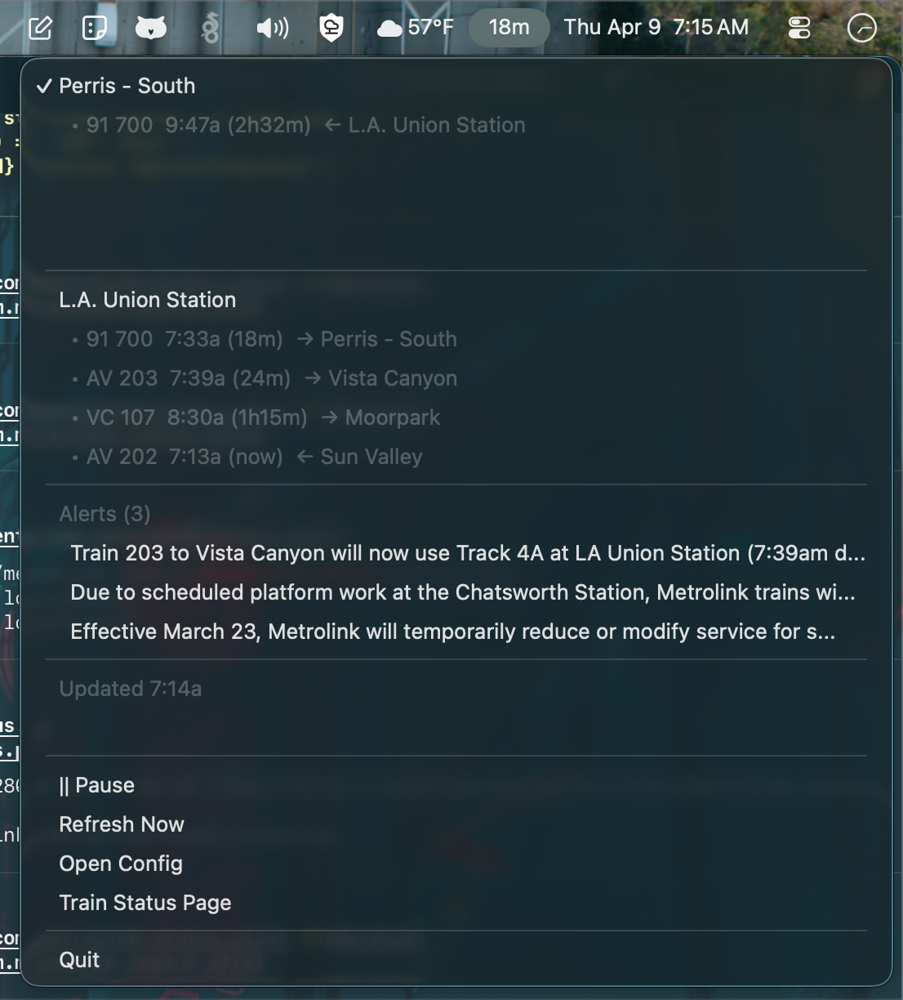

# Metrolink Status

Real-time Metrolink train departures and service alerts in your macOS menu bar. Glance at the menu bar, know when the next train leaves.



## What it does

- Shows countdown to next departure at your selected station
- Delay severity in the menu bar — `12m` on time, `12m *` minor, `12m **` moderate, `12m ***` severe
- Dropdown shows full departure board with train numbers, times, and destinations
- Service alerts from Metrolink (no API key needed for alerts)
- Schedule-aware — only polls during your commute windows, sleeps otherwise
- Click a station name to switch which one drives the menu bar display
- Monochrome menu bar style that blends with native macOS

## Requirements

- macOS 10.14+
- Python 3.8+
- Metrolink GTFS-RT API key (free): [Request one here](https://metrolinktrains.com/about/gtfs/gtfs-rt-access/)

## Quick start

```bash
pip install rumps requests gtfs-realtime-bindings protobuf
python3 metrolink_status.py
```

On first run, the app creates a config file and tells you an API key is needed. Click "Open Config" in the menu bar dropdown, paste your key, save, and relaunch.

## Config

`~/.config/metrolink_status/config.json`

```json
{
  "api_key": "YOUR_METROLINK_GTFSRT_KEY",
  "stations": [
    {
      "name": "Burbank - Downtown",
      "stop_id": "102",
      "routes": ["Antelope Valley Line", "Ventura County Line"]
    },
    {
      "name": "L.A. Union Station",
      "stop_id": "107",
      "routes": []
    }
  ],
  "poll_interval_seconds": 120,
  "active_hours": {
    "morning": {"start": "05:00", "end": "10:30", "show_station": 0},
    "evening": {"start": "14:00", "end": "20:30", "show_station": 1}
  },
  "skip_days": [4],
  "always_active": false,
  "menu_bar_station": 0,
  "menu_bar_format": "compact",
  "show_alerts": true,
  "max_departures": 4
}
```

### Key settings

| Field | Description |
|-------|-------------|
| `api_key` | Your Metrolink GTFS-RT API key |
| `stations[].stop_id` | Numeric stop ID from Metrolink GTFS (see table below) |
| `stations[].routes` | Filter to these route names, or `[]` for all |
| `poll_interval_seconds` | How often to poll the feed (default 120, minimum 30) |
| `active_hours.*.show_station` | Auto-switch menu bar to this station index during this window |
| `skip_days` | Days to skip polling. `0`=Mon, `4`=Fri, `5`=Sat, `6`=Sun |
| `always_active` | Set `true` to poll all day, every day |
| `menu_bar_format` | `"compact"` = `12m`, `"full"` = `AV227 12m` |

### Menu bar format

| State | Compact | Full |
|-------|---------|------|
| On time | `12m` | `AV227 12m` |
| Minor delay | `12m *` | `AV227 12m *` |
| Moderate | `12m **` | `AV227 12m **` |
| Severe | `12m ***` | `AV227 12m ***` |
| No data | `--` | `--` |
| Paused | `\|\|` | `\|\|` |

### Dropdown status indicators

| Symbol | Meaning |
|--------|---------|
| `•` | On time |
| `‣` | Minor delay (<5 min) |
| `▸` | Moderate delay (5-10 min) |
| `◆` | Severe delay (10+ min) |

### Route names (for config)

| Route | `route_id` value |
|-------|-----------------|
| Antelope Valley | `Antelope Valley Line` |
| Ventura County | `Ventura County Line` |
| San Bernardino | `San Bernardino Line` |
| Riverside | `Riverside Line` |
| Orange County | `Orange County Line` |
| Inland Empire-OC | `Inland Emp.-Orange Co. Line` |
| 91/Perris Valley | `91 Line` |
| Arrow | `Arrow` |

### Stop IDs

| ID | Station | ID | Station |
|----|---------|-----|---------|
| 101 | Baldwin Park | 145 | Orange |
| 102 | Burbank - Downtown | 147 | Corona - North Main |
| 103 | Chatsworth | 148 | Riverside - La Sierra |
| 104 | Covina | 152 | San Clemente |
| 105 | El Monte | 153 | San Juan Capistrano |
| 106 | Glendale | 154 | Santa Ana |
| 107 | L.A. Union Station | 156 | Tustin |
| 108 | Moorpark | 161 | Vista Canyon |
| 109 | Pomona - North | 162 | Lancaster |
| 110 | Sylmar / San Fernando | 163 | Palmdale |
| 111 | Santa Clarita | 164 | Via Princessa |
| 112 | Simi Valley | 165 | Vincent Grade / Acton |
| 113 | Van Nuys | 166 | Camarillo |
| 114 | Claremont | 167 | Northridge |
| 115 | Cal State LA | 168 | Oxnard |
| 116 | Fontana | 169 | Ventura - East |
| 117 | Ontario - East | 170 | Burbank Airport - South |
| 118 | Montclair | 171 | Anaheim Canyon |
| 119 | Jurupa Valley / Pedley | 173 | Corona - West |
| 120 | Pomona - Downtown | 174 | Fullerton |
| 121 | Rancho Cucamonga | 175 | Newhall |
| 122 | Rialto | 181 | Riverside - Hunter Park |
| 123 | Riverside - Downtown | 182 | Moreno Valley / March Field |
| 124 | San Bernardino Depot | 183 | Perris - Downtown |
| 125 | Upland | 184 | Perris - South |
| 126 | Montebello / Commerce | 185 | San Bernardino - Downtown |
| 127 | Industry | 186 | Burbank Airport - North |
| 128 | Anaheim - ARTIC | 188 | San Bernardino - Tippecanoe |
| 129 | Sun Valley | 189 | Redlands - Esri |
| 130 | Buena Park | 190 | Redlands - Downtown |
| 135 | Commerce | 191 | Redlands - University |

## Run at login

### LaunchAgent (recommended)

```bash
cat > ~/Library/LaunchAgents/com.metrolink-status.plist << 'EOF'
<?xml version="1.0" encoding="UTF-8"?>
<!DOCTYPE plist PUBLIC "-//Apple//DTD PLIST 1.0//EN"
  "http://www.apple.com/DTDs/PropertyList-1.0.dtd">
<plist version="1.0">
<dict>
    <key>Label</key>
    <string>com.metrolink-status</string>
    <key>ProgramArguments</key>
    <array>
        <string>/usr/local/bin/python3</string>
        <string>SCRIPT_PATH/metrolink_status.py</string>
    </array>
    <key>EnvironmentVariables</key>
    <dict>
        <key>PYTHONWARNINGS</key>
        <string>ignore</string>
    </dict>
    <key>RunAtLoad</key>
    <true/>
    <key>StandardOutPath</key>
    <string>/tmp/metrolink_status.stdout.log</string>
    <key>StandardErrorPath</key>
    <string>/tmp/metrolink_status.stderr.log</string>
</dict>
</plist>
EOF

# Fix the path to where you put the script
sed -i '' "s|SCRIPT_PATH|$(pwd)|g" ~/Library/LaunchAgents/com.metrolink-status.plist

launchctl load ~/Library/LaunchAgents/com.metrolink-status.plist
```

## Data sources

- **Trip updates:** Metrolink GTFS-RT protobuf feed (requires free API key)
- **Service alerts:** Metrolink public alerts feed (no key required)
- **Stop/route mapping:** Metrolink static GTFS data (bundled in the app)

Feed documentation: [metrolinktrains.com/about/gtfs](https://metrolinktrains.com/about/gtfs/)

## Logs

`~/.config/metrolink_status/metrolink_status.log`

## Troubleshooting

**"ML: no key" in menu bar** — Open config, add your API key, relaunch.

**"No upcoming departures"** — Normal outside service hours. Try "Refresh Now" during commute times. Check the log for API errors.

**Wrong trains showing** — Adjust `routes` in your station config to filter to specific lines.

**Feed errors** — Verify your key works: `curl -s -H "X-Api-Key: YOUR_KEY" https://metrolink-gtfsrt.gbsdigital.us/feed/gtfsrt-trips -o test.pb && wc -c test.pb`

## License

MIT
